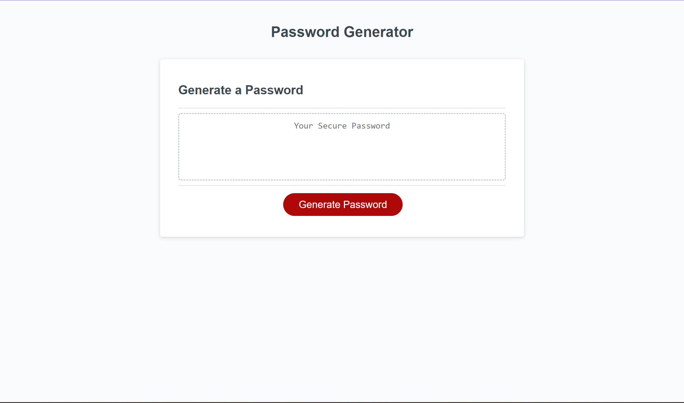
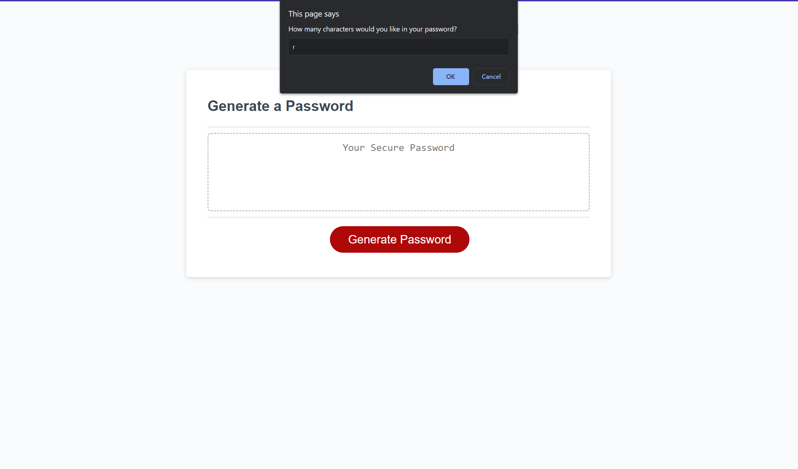
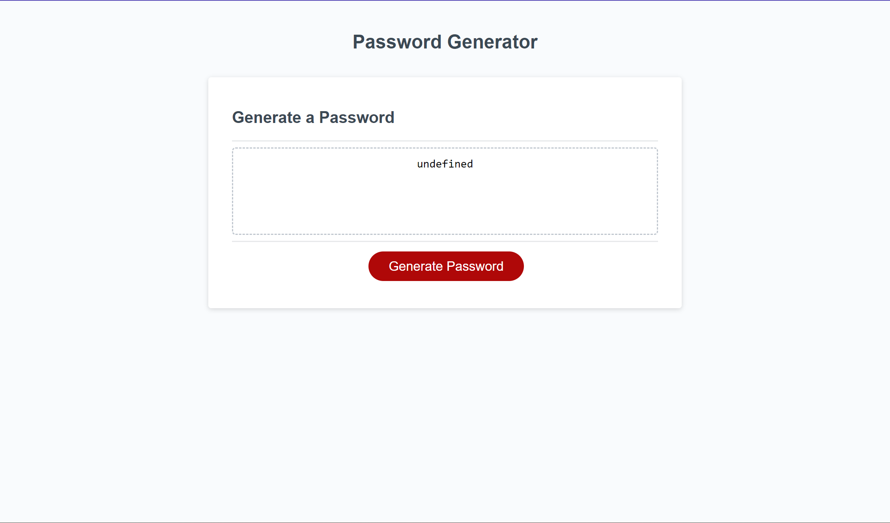
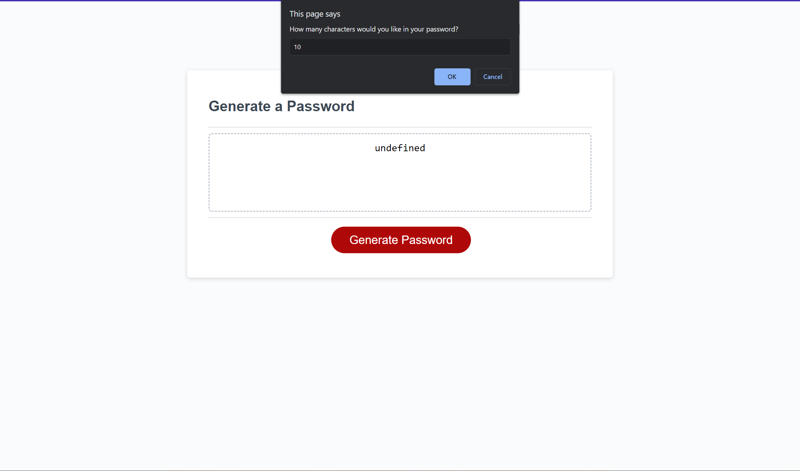
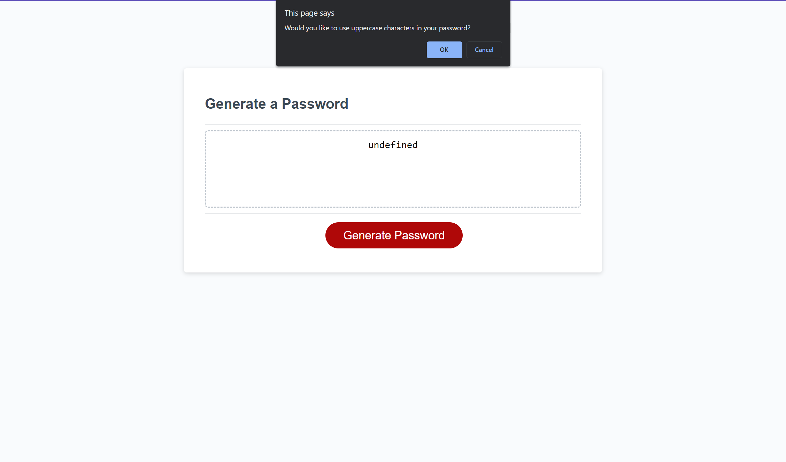
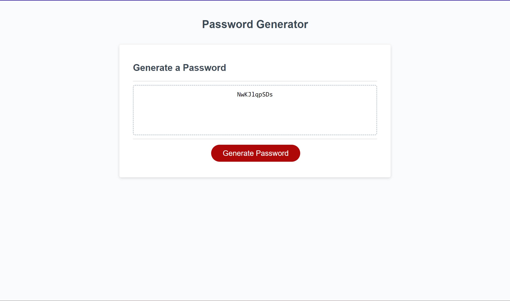

# Password Generator

## Description

This is a password generator that generates a random password for the user

GIVEN I need a new, secure password
WHEN I click the button to generate a password
THEN I am presented with a series of prompts for password criteria
WHEN prompted for password criteria
THEN I select which criteria to include in the password
WHEN prompted for the length of the password
THEN I choose a length of at least 8 characters and no more than 128 characters
WHEN asked for character types to include in the password
THEN I confirm whether or not to include lowercase, uppercase, numeric, and/or special characters
WHEN I answer each prompt
THEN my input should be validated and at least one character type should be selected
WHEN all prompts are answered
THEN a password is generated that matches the selected criteria
WHEN the password is generated
THEN the password is either displayed in an alert or written to the page

## Usage

User enters length of password. If the number entered is not a number, then return is passed into the function, 

 If the number entered is a number, then user is allowed to enter in 
 a set of parameters (lowercase, uppercase, numerical characters, special characters) for their password. 
 
 If nothing is passed in, then return is passed, but if at least one thing is passed, then the password is rendered on the screen

## Credits

Developed by:

https://github.com/coding-boot-camp/friendly-parakeet
